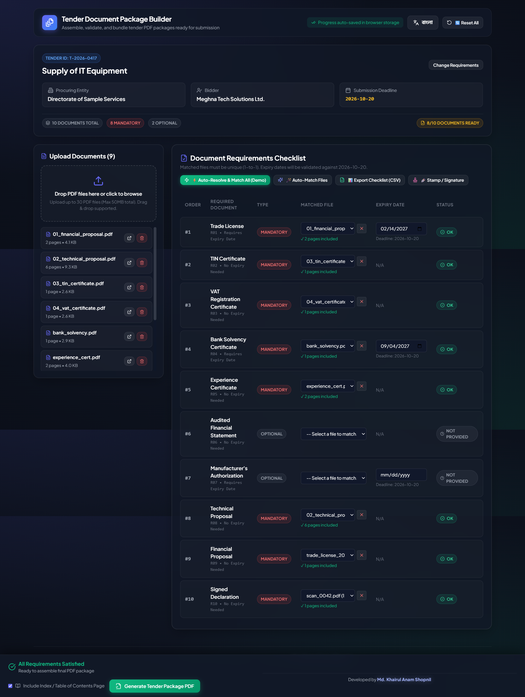

# Tender Document Package Builder

> An intelligent, client-side web application designed to help office staff turn a collection of PDF files into a complete, verified, and correctly ordered tender PDF package ready for official submission.

Built for **AI DevFest** • Developed by **Md. Khairul Anam Shopnil**

---

## 📸 Real-time Application Interface & Document Statuses



---

## 🚀 Live Demo & Deployment
- **Live URL**: `[INSERT_YOUR_PUBLIC_HTTPS_DEPLOYMENT_URL_HERE]`
- **GitHub Repository**: [https://github.com/mdshopnil071/devfest-242-35-071](https://github.com/mdshopnil071/devfest-242-35-071)

---

## ✨ Key Features

### 1. 100% Client-Side Architecture (Frontend Only)
- Completely runs inside the browser with zero backend dependencies, zero private API calls, and no user login/signup required.
- Uses `pdf-lib` for in-browser PDF parsing, page extraction, merging, and footer rendering.
- State persistence using browser `localStorage` for auto-saving progress.

### 2. Intelligent Requirements & Document Validation (Section 4 & 5)
- **JSON Tender Import**: Parses `requirements.json`, extracts tender metadata, and displays requirements strictly ordered by `order`.
- **Bulk Upload & PDF Inspection**: Drag & drop support up to 30 files / 50MB. Extracts exact page counts and rejects non-PDF or corrupt files with clear alerts.
- **1-to-1 Matching Engine**: Enforces strict one-file-to-one-requirement matching with instant undo and re-assignment.
- **SHA-256 Duplicate Content Detection**: Uses native Web Crypto API to detect duplicate content regardless of filename differences. Disables duplicate matching across multiple requirements and provides a 1-click duplicate cleaner.
- **Dynamic Expiry Date Validation**: Compares document expiry dates against the tender `submission_deadline`.
- **Real-time Reactive Status Indicators**:
  - `OK` (Non-blocking): Matched and valid.
  - `Not provided` (Non-blocking): Optional requirement skipped.
  - `Missing` (Blocking): Mandatory requirement with no file matched.
  - `Expiry date needed` (Blocking): Requirement requires expiry date but none entered.
  - `Expired` (Blocking): Document expires prior to tender submission deadline.

### 3. Standards-Compliant PDF Package Generation (Section 6)
- **Executive Cover Page (Page 1)**: Formatted in English with Tender ID, Title, Procuring Entity, Bidder, Submission Deadline, Package Date, and an ordered table of included documents.
- **Index & Table of Contents Page (Bonus)**: Computes start and end page numbers for all attached documents.
- **Sequential Document Merging**: Combines document pages in exact order, omitting unmatched optional files.
- **Header & Footer Placement**: Renders `<tender_id> | Page X of Y` on every single page (including cover & index) with protective opacity background so document text is never obscured.
- **Download**: Directly packages and downloads `<tender_id>_Package.pdf` with confetti animation.

### 4. Bilingual Support & Accessibility (Section 4.9)
- Instant toggle between **English** and **বাংলা (Bengali)** for all UI elements, tooltips, statuses, and requirement titles (`title_en` / `title_bn`).
- Responsive, mobile-friendly design with touch optimization and high-contrast dark theme aesthetics.
- Persistent developer credit: **Developed by Md. Khairul Anam Shopnil**.

### 5. Bonus Superpowers (Section 7)
- 🪄 **Auto-Match Engine**: Suggests document-to-file matches based on filename keyword scoring.
- ⚡ **Auto-Resolve Demo Mode**: 1-click solver for sample packs that cleans duplicates, selects valid documents, and sets valid dates for instant judging.
- ✒️ **Official Seal & Signature Overlay**: Upload a PNG seal/signature and apply it to all pages, cover page only, or final page.
- 📊 **Checklist Export**: Export the real-time checklist to CSV (Excel compatible with UTF-8 BOM).

---

## 🛠️ Technology Stack
- **Framework**: React 18, Vite 6
- **Styling**: Vanilla CSS (Tailored Design System, Glassmorphic UI)
- **PDF Engine**: `pdf-lib`
- **Icons**: `lucide-react`
- **Celebration Effects**: `canvas-confetti`

---

## 💻 Getting Started Locally

### Installation & Run
```bash
# Clone the repository
git clone https://github.com/mdshopnil071/devfest-242-35-071.git
cd devfest-242-35-071

# Install dependencies
npm install

# Start development server
npm run dev
```

Visit `http://localhost:5173/` in Google Chrome or any modern browser.

### Production Build
```bash
npm run build
```

---

## 📁 Repository Structure
```
├── output/
│   └── T-2026-0417_Package.pdf       # Verified sample-pack package output
├── screenshots/
│   └── document_statuses.png         # Real-time document statuses screenshot
├── sample-pack/                      # Contest sample pack (requirements & PDFs)
├── public/
│   └── sample-pack/                  # Static assets for demo quick-load
├── src/
│   ├── components/                   # Modular React UI components
│   ├── locales/                      # Bilingual translations (EN / BN)
│   ├── utils/                        # PDF generator, hasher, validator, matcher
│   ├── App.jsx                       # Main application state orchestrator
│   └── index.css                     # Design tokens & responsive styles
├── index.html
├── package.json
└── vite.config.js
```